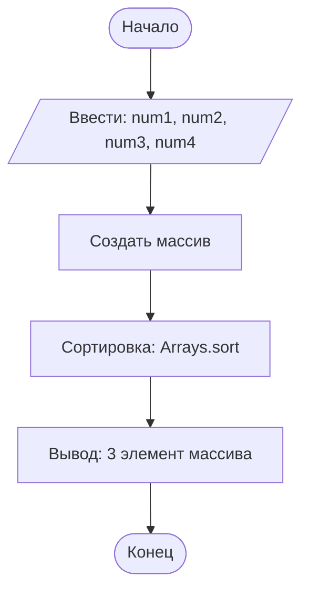

## Отчет по лабораторной работе № 1

#### № группы: `ПМ-2601`

#### Выполнил: `Талаев Владислав Валентинович`

#### Вариант: `24`

### Cодержание:

- [Постановка задачи](#1-постановка-задачи)
- [Входные и выходные данные](#2-входные-и-выходные-данные)
- [Выбор структуры данных](#3-выбор-структуры-данных)
- [Алгоритм](#4-алгоритм)
- [Программа](#5-программа)
- [Анализ правильности решения](#6-анализ-правильности-решения)

### 1. Постановка задачи

- Условия задачи

>На вход программы подается четыре различных целых числа. Вывести на
экран число, которое меньше одного и больше двух других чисел (то есть,
это число в отсортированной последовательности стояло бы третьим).

-  Нужно поместить 4 числа в массив из четырех элементов
-  Отсортировать массив по возрастанию с помощью встроенного сортировщика
-  Вывести 3 элемент массива.

### 2. Входные и выходные данные

#### Данные на вход
На вход программа должна получить 4 числа, при этом в условии сказано, что данные числа
принадлежат к множеству целых чисел, поэтому будем использовать 'int'. В условии границы не даны,
поэтому возьмем диапазон для 32 бит(int).
|             | Тип                | min значение    | max значение   |
|-------------|--------------------|-----------------|----------------|
| num1 (Число 1) | Целое число | -2<sup>31</sup>  | 2<sup>31</sup> -1 |
| num2 (Число 2) | Целое число | -2<sup>31</sup>  | 2<sup>31</sup> -1 |
| num3 (Число 3) | Целое число | -2<sup>31</sup>  | 2<sup>31</sup> -1 |
| num4 (Число 4) | Целое число | -2<sup>31</sup>  | 2<sup>31</sup> -1 |

#### Данные на выход
|             | Тип                | min значение    | max значение   |
|-------------|--------------------|-----------------|----------------|
| Число(end) | Целое число | -2<sup>31</sup>  | 2<sup>31</sup> -1 |

### 3. Выбор структуры данных

Программа получает 4 целых числа, поэтому для их хранения можно выделить 4 переменные
(num1, num2, num3, num4) типа 'int'.
Для вывода данных используется 'nums[2]', где nums - массив, а 2 - индекс элемента.

### 4. Алгоритм

1. Считываем 4 целых числа из консоли
2. Создаем жесткий массив, в который сразу отправляем 4 переменные
3. С помощью встроенного сортировщика сортируем по возрастанию
4. Выводим число, которое стоит 3 в отсортированном массиве



### 5. Программа

Нужно вставить код прямо в отчет в блок:

```java
// используем две библеотеки - Arrays для того,чтобы воспользоваться
// встроенной сортировкой и Scanner для ввода данных с клавиатуры
import java.util.Arrays;
import java.util.Scanner;

public class Main { //обьявляем класс программы
    public static void main(String [] args){
        Scanner in = new Scanner(System.in); // обьявляем Scanner для ввода данных с клавиатуры
        // создаем 4 переменные, в которые будем записывать целые числа с клавиатуры
        int num1 = in.nextInt();
        int num2 = in.nextInt();
        int num3 = in.nextInt();
        int num4 = in.nextInt();
        // создаем жесткий массив, в котором размер задается один раз
        // в данном массиве Java выделает ровно 4 ячейки под целые числа
        int [] nums = {num1, num2, num3, num4};
        // Arrays - встроенная сортировка( в данном случае дополнительный компаратор не нужен)
        // Сортировка пройдет по умолчанию, то есть по возрастанию
        Arrays.sort(nums);
        // nums[2] - означает, что мы берем 3ий элемент массива,
        // так как нумерация идет не с 1, а с 0, поэтому нужен индекс 2 соответствующий 3 элементу
        System.out.println(nums[2]);
    }
}
```

### 6. Анализ правильности решения

Программа работает корректно именно на различных наборах данных(по условию задачи)
1. Тест на числа >0:

- Input:
    ```
    10 20 30 40
    ```

- Output:
    ```
    30
    ```

2. Тест на числа <0:

- Input:
    ```
    -60 -45 -130 -3
    ```

- Output:
    ```
    -45
    ```
3. Тест на числа >0 и <0:

- Input:
    ```
    -90 56 -1377 3
    ```

- Output:
    ```
    3
    ```
