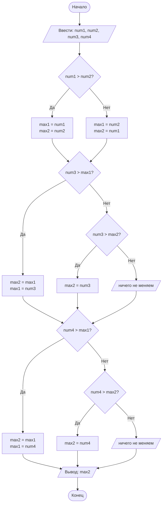

## Отчет по лабораторной работе № 1

#### № группы: `ПМ-2601`

#### Выполнил: `Талаев Владислав Валентинович`

#### Вариант: `24`

### Cодержание:

- [Постановка задачи](#1-постановка-задачи)
- [Входные и выходные данные](#2-входные-и-выходные-данные)
- [Выбор структуры данных](#3-выбор-структуры-данных)
- [Алгоритм](#4-алгоритм)
- [Программа](#5-программа)
- [Анализ правильности решения](#6-анализ-правильности-решения)

### 1. Постановка задачи

- Условия задачи

>На вход программы подается четыре различных целых числа. Вывести на
экран число, которое меньше одного и больше двух других чисел (то есть,
это число в отсортированной последовательности стояло бы третьим).

-  Для начала нужно считать с консоли 4 переменные;
-  Найти второе по величине число с помощью сравнения;
-  Вывести найденное число.

### 2. Входные и выходные данные

#### Данные на вход
На вход программа должна получить 4 числа, при этом в условии сказано, что данные числа
принадлежат к множеству целых чисел, поэтому будем использовать 'int'. В условии границы не даны,
поэтому возьмем диапазон для 32 бит(int).
|             | Тип                | min значение    | max значение   |
|-------------|--------------------|-----------------|----------------|
| num1 (Число 1) | Целое число | -2<sup>31</sup>  | 2<sup>31</sup> -1 |
| num2 (Число 2) | Целое число | -2<sup>31</sup>  | 2<sup>31</sup> -1 |
| num3 (Число 3) | Целое число | -2<sup>31</sup>  | 2<sup>31</sup> -1 |
| num4 (Число 4) | Целое число | -2<sup>31</sup>  | 2<sup>31</sup> -1 |

#### Данные на выход
|             | Тип                | min значение    | max значение   |
|-------------|--------------------|-----------------|----------------|
| max2 | Целое число | -2<sup>31</sup>  | 2<sup>31</sup> -1 |

### 3. Выбор структуры данных

Программа получает 4 целых числа, поэтому для их хранения можно выделить 4 переменные
(num1, num2, num3, num4) типа 'int'.
Для работы программы потребуется 2 дополнительные переменные( max1, max2 ), где 
- max1 - самое большое число из просмотренных;
- max2 - второе по величине число из уже просмотренных.

### 4. Алгоритм

1. Считываем 4 целых числа из консоли;
2. Сравниваем первые два числа: больше записываем в max1, меньшее - в max2;
3. Проверяем третье число:
   - если оно больше max1, то старое max1 становится max2, а третье число - max1;
   - иначе если оно больше max2, то становится max2;
4. Аналогично проверяем четвертое число;
5. Выводим max2.



### 5. Программа

```java
import java.util.Scanner;

public class Main{ // обьявляем класс программы
    public static void main(String[] args){
        // обьявляем Scanner, чтобы считать данные
        Scanner in = new Scanner(System.in);
        // создаем 4 переменные, в которые будут записоваться целые числа
        int num1 = in.nextInt();
        int num2 = in.nextInt();
        int num3 = in.nextInt();
        int num4 = in.nextInt();

        // обьявляем две переменные, где max1 - максимальное, а
        // max2 - второе по велечине
        int max1, max2;

        // сначала сравниваем первые два числа и кладем их
        // в max1, max2 по порядку
        if(num1 > num2){
            max1 = num1;
            max2 = num2;
        } else {
            max1 = num2;
            max2 = num1;
        }
        // на данный момент у нас в max1 сохранено максимальное
        // число среди первых двух чисел

        // теперь проверяем третье число и сравниваем с max1
        if(num3 > max1){
            max2=max1;
            max1=num3;
        } else { // также мы должны проверить num3 c max2, а не просто переприсвоить
            // иначе мы можем потеряем нужный элемент.
            if(num3>max2){
                max2 = num3;
            }
        }
        // Аналогично с третим числом повторяем те же дейсвтия для четвертого числа
        if (num4 > max1){
            max2 = max1;
            max1 = num4;
        } else {
            if(num4>max2){
                max2 = num4;
            }
        }
        // Выводим второе по велечине число
        System.out.println(max2);
    }
}
```

### 6. Анализ правильности решения

Программа работает корректно именно на различных наборах данных(по условию задачи)
1. Тест на числа >0:

- Input:
    ```
    10 20 30 40
    ```

- Output:
    ```
    30
    ```

2. Тест на числа <0:

- Input:
    ```
    -60 -45 -130 -3
    ```

- Output:
    ```
    -45
    ```
3. Тест на числа >0 и <0:

- Input:
    ```
    -90 56 -1377 3
    ```

- Output:
    ```
    3
    ```
